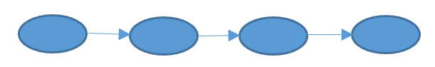
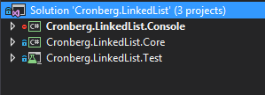
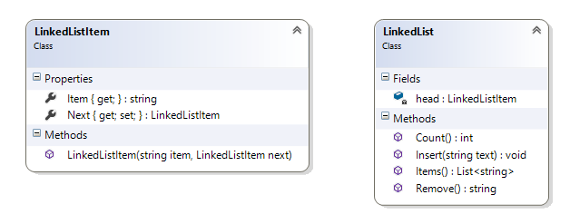

# Opgave i C#: Hægtet liste

Her er endnu en simpel C# opgave – denne gang med fokus på organisering af projekter, brug af referencer og lidt leg med generics.

Opgaven er delt i to dele:

- Skab en simpel hægtet liste hvor hver node kan indeholde en streng
- Skab en simpel men nu generisk hægtet liste hvor hver node kan indeholde ”hvad som helst”

Du har sikkert allerede kendskab til hægtede lister – enten gennem din uddannelse, fra kode test i forbindelse med job søgning eller bare for sjov. Det er nemlig en både simpel og nem datastruktur som alligevel kræver lidt gennemtænkt og afprøvet kode, samt forståelse for referencer (nogle ville kalde det pointere, men da C# jo både er type stærkt og type sikkert, er referencer et bedre begreb).

> Vidste du, at man i C# faktisk godt kan skrive eksempelvis int* p – altså en pointer til en int. Det kræver dog både brug af unsafe-kodeordet samt et kompilerflag. Det anbefales ikke i standard C# kode.

Har du ikke leget med hægtede lister er her en kort forklaring. En hægtet liste er en samling af objekter som består af data (i vores første eksempel blot en streng), samt en reference til det næste objekt. Objekterne kaldes typisk for ”noder”, og listen kan være så lang som der nu er plads i heap’en. Listen stopper automatisk når den sidste node’s reference til det næste objekt er null. Det smarte ved hægtede lister er, at det grundet brugen af referencer er hurtigt at tilføje og fjerne noder på listen, sortere, filtrere og så videre.



I den virkelige verden vil man næppe kode sin egen liste-datastruktur. De findes jo i mange forskellige versioner under både System.Collection og især System.Collection.Generic, og denne opgave minder en del om en Stack – men her skal du altså kode den selv.

## En ikke generisk hægtet liste

Start med at skabe en tom solution og kald den noget logisk som eksempelvis [efternavn].LinkedList. Tilføj nu et nyt projekt af typen klasse bibliotek (løsningen er ældre og baseret på .NET Framework, men du bør benytte .NET Standard), og kald det [efternavn].LinkedList.Core. Tilføj også et nyt projekt af typen Console, og kald det [efternavn].LinkedList.Console, og slutteligt et nyt projekt af typen Unit Test og kald det [efternavn].LinkedList.Test. Sørg for, at både Console- og Test-projektet har en reference til Core.



I Core-projektet tilføjer du nu en mappe kaldet NonGeneric, og i denne to offentlige klasser:

- LinkedListItem (repræsenterer vores noder)
- LinkedList (repræsenterer vores liste)

De vil så automatisk være placeret i et namespace kaldet [efternavn].LinkedList.Core.NonGeneric. Så langt så godt.

Dit job er nu at tilføje en egenskab (string) kaldet Item til LinkedListItem, samt en egenskab kaldet Next, som kan ”pege” på den eventuel næste node. Yderligere kan du tilføje en constructor der initialiserer medlemmerne.

Klassen LinkedList skal bestå af en privat egenskab kaldet Head af typen LinkedListItem. Den repræsenterer listens første node (resten peger jo på hinanden), samt følgende metoder:

- void Insert(string) : tilføjer en ny node i enden af listen (svarer lidt til en Push på en Stack)
- string Remove() : fjerner den sidste node, og returnerer dennes streng (svarer lidt til en Pop på en Stack)
- int Count() : returnerer antallet af noder
- List<string> Items: Returnerer en liste af strenge svarende til streng værdien i de enkelte noder



Når du er færdig kan du teste klasserne med følgende kode i Console-projektet:

```csharp
Cronberg.LinkedList.Core.NonGeneric.LinkedList lst = 
    new Core.NonGeneric.LinkedList();
lst.Insert("item 1");
lst.Insert("item 2");

Console.WriteLine(lst.Count());
Console.WriteLine(string.Join(", ", lst.Items()));

var item = lst.Remove();
Console.WriteLine(lst.Count());
Console.WriteLine(string.Join(", ", lst.Items()));

item = lst.Remove();
Console.WriteLine(lst.Count());
Console.WriteLine(string.Join(", ", lst.Items()));
```

Det burde resultere i:

```
2
item 1, item 2
1
item 1
0
```

Du kan også tilføje et par unit test til Test-projektet – eksempelvis:

```csharp
[TestClass]
public class LinkedListNonGenericTest
{
    [TestMethod]
    public void NonGenericTestInsert()
    {
        Cronberg.LinkedList.Core.NonGeneric.LinkedList s =
            new Cronberg.LinkedList.Core.NonGeneric.LinkedList();
        Assert.IsTrue(s.Count() == 0);

        s.Insert("text 1");
        Assert.IsTrue(s.Count() == 1);

        s.Insert("text 2");
        Assert.IsTrue(s.Count() == 2);

        for (int i = 3; i < 100; i++)
            s.Insert("text " + i);

        Assert.IsTrue(s.Count() == 99);

    }

    [TestMethod]
    public void NonGenericTestRemove()
    { … }

    [TestMethod]
    public void NonGenericTestItems()
    { … }
}
```
Se eventuel løsning på GitHub (se senere) for eksempler på andre Test-metoder.

## En generisk hægtet liste

Når du har fået den ikke generiske liste til at spille (hvor noderne jo kun kan indeholde en streng) er det tid til at skabe en generisk version af LinkedListItem og LinkedList (placer de nye klasser i en ny mappe kaldet Generic). Det smarte ved den generiske version er dels at den nye liste kan indeholde alle typer – det defineres ved initialisering (<type>) – samt det faktum, at det faktisk kræver en meget lille ændring af de allerede eksisterende klasser. Du kan starte med at kopiere de to oprindelige klasser, og så sørge for at rette string til en generisk type. Husk at både klasse og argumenter skal være generisk. Se evt. løsning hvis du er i tvivl – men skriv koden selv.

Den generiske version kan testes som følger i Console-projektet – her en liste af int’s:

```csharp
Cronberg.LinkedList.Core.Generic.LinkedList<int> lst =
    new Core.Generic.LinkedList<int>();
lst.Insert(1);
lst.Insert(2);

WriteLine(lst.Count());
WriteLine(string.Join(", ", lst.Items()));

var item = lst.Remove();
WriteLine(lst.Count());
WriteLine(string.Join(", ", lst.Items()));

item = lst.Remove();
WriteLine(lst.Count());
WriteLine(string.Join(", ", lst.Items()));
```

Prøv også med en ListedList< string > og LinkedList< DateTime > (mv). Du skal naturligvis skrive nye test til den generiske version. Hold nu fast hvor er generics en smart feature – eller? ;)

Se mit forslag til løsning [her](https://github.com/devcronberg/os-cs-linkedlist), som dog er baseret på det gamle .NET Framework. Du kan blot benytte .NET Core/Standard.

